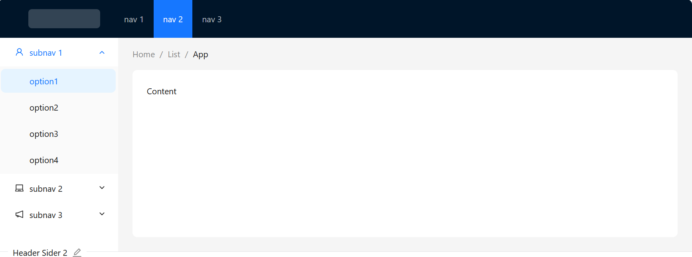

Different button styles generated by setting Button properties. The recommended order is: type -> shape -> size -> loading -> disabled.

## Button API
Property	Description	Type	Default	Version

autoInsertSpace	We add a space between two Chinese characters by default, which removed by setting autoInsertSpace to false.	boolean	true	5.17.0

block	Option to fit button width to its parent width	boolean	false	

classNames	Semantic DOM class	Record<SemanticDOM, string>	-	5.4.0

color	Set button color	default | primary | danger | PresetColors	-	default, primary and danger: 5.21.0, PresetColors: 5.23.0

danger	Syntactic sugar. Set the danger status of button. will follow color if provided	boolean	false

disabled	Disabled state of button	boolean	false	

ghost	Make background transparent and invert text and border colors	boolean	false

href	Redirect url of link button	string	-

htmlType	Set the original html type of button, see: MDN	submit | reset | button	button

icon	Set the icon component of button	ReactNode	-

iconPosition	Set the icon position of button	start | end	start	5.17.0

loading	Set the loading status of button	boolean | { delay: number, icon: ReactNode }	false	icon: 5.23.0

shape	Can be used to set button shape	default | circle | round	default	

size	Set the size of button	large | middle | small	middle	

styles	Semantic DOM style	Record<SemanticDOM, CSSProperties>	-	5.4.0

target	Same as target attribute of a, works when href is specified	string	-	

type	Syntactic sugar. Set button type. Will follow variant & color if provided	primary | dashed | link | text | default	default	

onClick	Set the handler to handle click event	(event: React.MouseEvent<HTMLElement, MouseEvent>) => void	-

variant	Set button variant	outlined | dashed | solid | filled | text | link	


## FloatButtonAPI
#### common API
Property	Description	Type	Default	Version
icon	Set the icon component of button	ReactNode	-	
description	Text and other	ReactNode	-	
tooltip	The text shown in the tooltip	ReactNode | TooltipProps	-	TooltipProps: 5.25.0
type	Setting button type	default | primary	default	
shape	Setting button shape	circle | square	circle	
onClick	Set the handler to handle click event	(event) => void	-	
href	The target of hyperlink	string	-	
target	Specifies where to display the linked URL	string	-	
htmlType	Set the original html type of button, see: MDN	submit | reset | button	button	5.21.0
badge	Attach Badge to FloatButton. status and other props related are not supported.	BadgeProps	-	5.4.0

#### FloatButton.Group
Property	Description	Type	Default	Version
shape	Setting button shape of children	circle | square	circle	
trigger	Which action can trigger menu open/close	click | hover	-	
open	Whether the menu is visible or not, use it with trigger	boolean	-	
closeIcon	Customize close button icon	React.ReactNode	<CloseOutlined />	
placement	Customize menu animation placement	top | left | right | bottom	top	5.21.0
onOpenChange	Callback executed when active menu is changed, use it with trigger	(open: boolean) => void	-	
onClick	Set the handler to handle click event (only work in Menu mode)	(event) => void	-	5.3.0

#### FloatButton.BackTop

Property	Description	Type	Default	Version
duration	Time to return to top（ms）	number	450	
target	Specifies the scrollable area dom node	() => HTMLElement	() => window	
visibilityHeight	The BackTop button will not show until the scroll height reaches this value	number	400	
onClick	A callback function, which can be executed when you click the button	() => void


## Layout API

API

<Layout>
  <Header>header</Header>
  <Layout>
    <Sider>left sidebar</Sider>
    <Content>main content</Content>
    <Sider>right sidebar</Sider>
  </Layout>
  <Footer>footer</Footer>
</Layout>

Layout

Common props ref：Common props

The wrapper.
Property	Description	Type	Default
className	Container className	string	-
hasSider	Whether contain Sider in children, don't have to assign it normally. Useful in ssr avoid style flickering	boolean	-
style	To customize the styles	CSSProperties	-
Layout.Sider

The sidebar.
Property	Description	Type	Default
breakpoint	Breakpoints of the responsive layout	xs | sm | md | lg | xl | xxl	-
className	Container className	string	-
collapsed	To set the current status	boolean	-
collapsedWidth	Width of the collapsed sidebar, by setting to 0 a special trigger will appear	number	80
collapsible	Whether can be collapsed	boolean	false
defaultCollapsed	To set the initial status	boolean	false
reverseArrow	Reverse direction of arrow, for a sider that expands from the right	boolean	false
style	To customize the styles	CSSProperties	-
theme	Color theme of the sidebar	light | dark	dark
trigger	Specify the customized trigger, set to null to hide the trigger	ReactNode	-
width	Width of the sidebar	number | string	200
zeroWidthTriggerStyle	To customize the styles of the special trigger that appears when collapsedWidth is 0	object	-
onBreakpoint	The callback function, executed when breakpoints changed	(broken) => {}	-
onCollapse	The callback function, executed by clicking the trigger or activating the responsive layout	(collapsed, type) => {}	-
breakpoint width

{
  xs: '480px',
  sm: '576px',
  md: '768px',
  lg: '992px',
  xl: '1200px',
  xxl: '1600px',
}

#### Examples 

```typescript jsx
import React from 'react';
import { UploadOutlined, UserOutlined, VideoCameraOutlined } from '@ant-design/icons';
import { Layout, Menu, theme } from 'antd';

const { Header, Content, Footer, Sider } = Layout;

const items = [UserOutlined, VideoCameraOutlined, UploadOutlined, UserOutlined].map(
  (icon, index) => ({
    key: String(index + 1),
    icon: React.createElement(icon),
    label: `nav ${index + 1}`,
  }),
);

const App: React.FC = () => {
  const {
    token: { colorBgContainer, borderRadiusLG },
  } = theme.useToken();

  return (
    <Layout>
      <Sider
        breakpoint="lg"
        collapsedWidth="0"
        onBreakpoint={(broken) => {
          console.log(broken);
        }}
        onCollapse={(collapsed, type) => {
          console.log(collapsed, type);
        }}
      >
        <div className="demo-logo-vertical" />
        <Menu theme="dark" mode="inline" defaultSelectedKeys={['4']} items={items} />
      </Sider>
      <Layout>
        <Header style={{ padding: 0, background: colorBgContainer }} />
        <Content style={{ margin: '24px 16px 0' }}>
          <div
            style={{
              padding: 24,
              minHeight: 360,
              background: colorBgContainer,
              borderRadius: borderRadiusLG,
            }}
          >
            content
          </div>
        </Content>
        <Footer style={{ textAlign: 'center' }}>
          Ant Design ©{new Date().getFullYear()} Created by Ant UED
        </Footer>
      </Layout>
    </Layout>
  );
};

export default App;
```




```typescript jsx
import React from 'react';
import { LaptopOutlined, NotificationOutlined, UserOutlined } from '@ant-design/icons';
import type { MenuProps } from 'antd';
import { Breadcrumb, Layout, Menu, theme } from 'antd';

const { Header, Content, Sider } = Layout;

const items1: MenuProps['items'] = ['1', '2', '3'].map((key) => ({
  key,
  label: `nav ${key}`,
}));

const items2: MenuProps['items'] = [UserOutlined, LaptopOutlined, NotificationOutlined].map(
  (icon, index) => {
    const key = String(index + 1);

    return {
      key: `sub${key}`,
      icon: React.createElement(icon),
      label: `subnav ${key}`,
      children: Array.from({ length: 4 }).map((_, j) => {
        const subKey = index * 4 + j + 1;
        return {
          key: subKey,
          label: `option${subKey}`,
        };
      }),
    };
  },
);

const App: React.FC = () => {
  const {
    token: { colorBgContainer, borderRadiusLG },
  } = theme.useToken();

  return (
    <Layout>
      <Header style={{ display: 'flex', alignItems: 'center' }}>
        <div className="demo-logo" />
        <Menu
          theme="dark"
          mode="horizontal"
          defaultSelectedKeys={['2']}
          items={items1}
          style={{ flex: 1, minWidth: 0 }}
        />
      </Header>
      <Layout>
        <Sider width={200} style={{ background: colorBgContainer }}>
          <Menu
            mode="inline"
            defaultSelectedKeys={['1']}
            defaultOpenKeys={['sub1']}
            style={{ height: '100%', borderRight: 0 }}
            items={items2}
          />
        </Sider>
        <Layout style={{ padding: '0 24px 24px' }}>
          <Breadcrumb
            items={[{ title: 'Home' }, { title: 'List' }, { title: 'App' }]}
            style={{ margin: '16px 0' }}
          />
          <Content
            style={{
              padding: 24,
              margin: 0,
              minHeight: 280,
              background: colorBgContainer,
              borderRadius: borderRadiusLG,
            }}
          >
            Content
          </Content>
        </Layout>
      </Layout>
    </Layout>
  );
};

export default App;
```


## Anchors

#### API

Common props ref：Common props
Anchor Props
Property	Description	Type	Default	Version
affix	Fixed mode of Anchor	boolean | Omit<AffixProps, 'offsetTop' | 'target' | 'children'>	true	object: 5.19.0
bounds	Bounding distance of anchor area	number	5	
getContainer	Scrolling container	() => HTMLElement	() => window	
getCurrentAnchor	Customize the anchor highlight	(activeLink: string) => string	-	
offsetTop	Pixels to offset from top when calculating position of scroll	number	0	
showInkInFixed	Whether show ink-square when affix={false}	boolean	false	
targetOffset	Anchor scroll offset, default as offsetTop, example	number	-	
onChange	Listening for anchor link change	(currentActiveLink: string) => void		
onClick	Set the handler to handle click event	(e: MouseEvent, link: object) => void	-	
items	Data configuration option content, support nesting through children	{ key, href, title, target, children }[] see	-	5.1.0
direction	Set Anchor direction	vertical | horizontal	vertical	5.2.0
replace	Replace items' href in browser history instead of pushing it	boolean	false	5.7.0
AnchorItem
Property	Description	Type	Default	Version
key	The unique identifier of the Anchor Link	string | number	-	
href	The target of hyperlink	string		
target	Specifies where to display the linked URL	string		
title	The content of hyperlink	ReactNode		
children	Nested Anchor Link, Attention: This attribute does not support horizontal orientation	AnchorItem[]	-	
replace	Replace item href in browser history instead of pushing it	boolean	false	5.7.0
Link Props

We recommend using the items form instead.
Property	Description	Type	Default	Version
href	The target of hyperlink	string		
target	Specifies where to display the linked URL	string		
title	The content of hyperlink	ReactNode

#### Examples

```typescript jsx
import React from 'react';
import { Anchor, Col, Row } from 'antd';

const App: React.FC = () => (
  <Row>
    <Col span={16}>
      <div id="part-1" style={{ height: '100vh', background: 'rgba(255,0,0,0.02)' }} />
      <div id="part-2" style={{ height: '100vh', background: 'rgba(0,255,0,0.02)' }} />
      <div id="part-3" style={{ height: '100vh', background: 'rgba(0,0,255,0.02)' }} />
    </Col>
    <Col span={8}>
      <Anchor
        items={[
          {
            key: 'part-1',
            href: '#part-1',
            title: 'Part 1',
          },
          {
            key: 'part-2',
            href: '#part-2',
            title: 'Part 2',
          },
          {
            key: 'part-3',
            href: '#part-3',
            title: 'Part 3',
          },
        ]}
      />
    </Col>
  </Row>
);

export default App;
```


